> ⚠️ **Work In Progress**: This project is currently in draft stage and under active development. Feel free to collaborate and contribute!

## Project Status

🚧 **This is a WIP (Work In Progress) draft project** - The implementation is functional but still being refined. Contributions, suggestions, and collaborations are welcome!

## Features

- **Design Tokens**: Colors, typography, spacing, shadows
- **Components**: Vue 3 and React component info with props, slots, events, examples
- **Documentation**: Full-text search across Mozaic docs
- **Code Generation**: Generate Vue/React component code snippets

## Quick Start

```bash
pnpm install
pnpm build:index  # Clone repos & build database
pnpm build        # Compile TypeScript
pnpm start        # Start MCP server
```

## Architecture

### Statistics Summary

<a href="./docs/doc.md">
  
</a>

### Data Flow

<a href="./docs/doc.md">
  
</a>

[View full documentation](./docs/doc.md)

## MCP Tools

| Tool                       | Description                                            |
| -------------------------- | ------------------------------------------------------ |
| `get_design_tokens`        | Get design tokens (colors, typography, spacing)        |
| `get_component_info`       | Get component details (props, slots, events, examples) |
| `list_components`          | List available components by category                  |
| `generate_vue_component`   | Generate Vue component code                            |
| `generate_react_component` | Generate React component code                          |
| `search_documentation`     | Full-text search Mozaic docs                           |

## License

MIT
