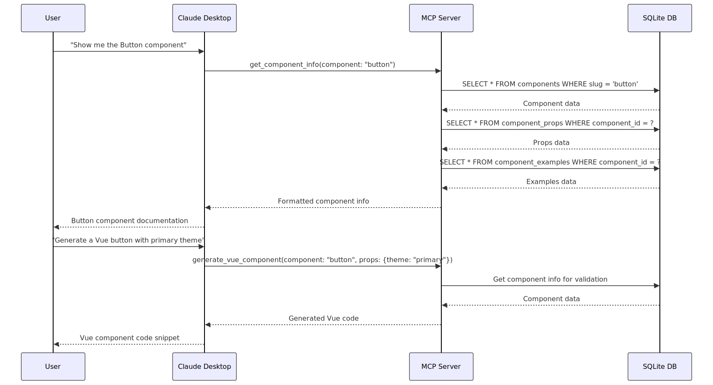
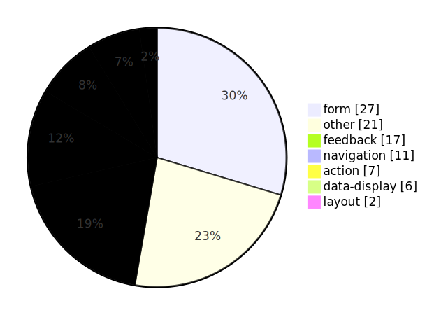
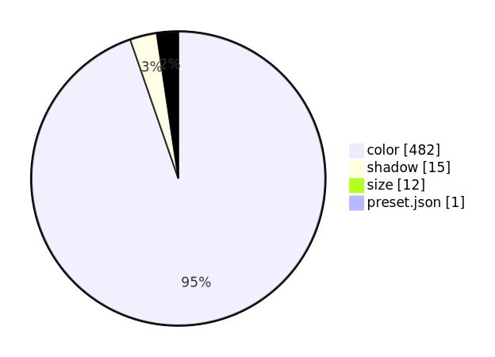

# Mozaic MCP Server - Architecture Documentation

> Auto-generated on 2025-12-14

## Current Statistics

| Metric | Count |
|--------|-------|
| Tokens | 510 |
| Components | 91 |
| Vue Components | 52 |
| React Components | 39 |
| Vue Examples | 238 |
| React Examples | 60 |
| Documentation | 247 |

## Diagrams

### Architecture Overview

### Project Structure

### Data Flow

### Database Schema

### MCP Tools

### Request Sequence

### Complete Overview

### Statistics

