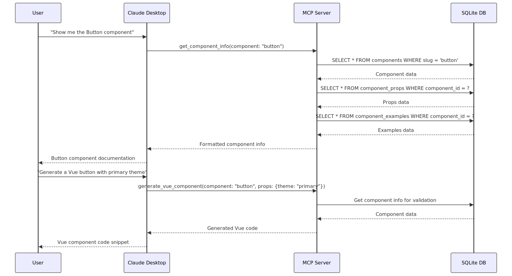
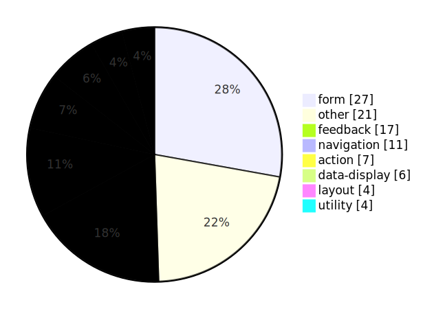
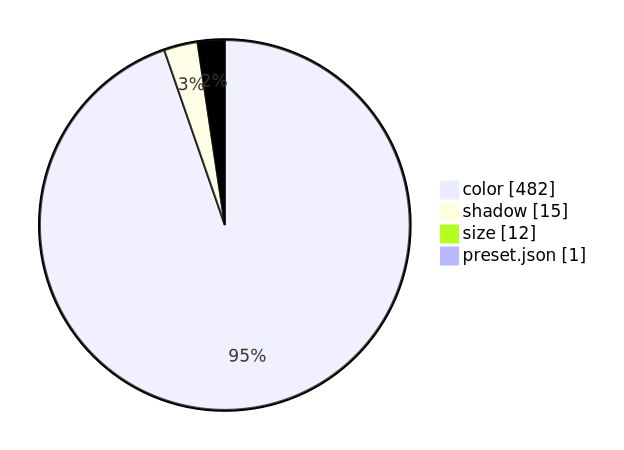

# Mozaic MCP Server - Architecture Documentation

> Auto-generated on 2025-12-14

## Current Statistics

| Metric | Count |
|--------|-------|
| **Tokens** | 586 |
| Token Properties (composite) | 15 |
| **Components** | 91 |
| Vue Components | 52 |
| React Components | 39 |
| Vue Examples | 238 |
| React Examples | 60 |
| **CSS Utilities** | 6 |
| CSS Utility Classes | 505 |
| **Documentation** | 247 |

### Token Categories

| Category | Count |
|----------|-------|
| color | 482 |
| typography | 60 |
| spacing | 19 |
| screen | 12 |
| grid | 4 |
| border | 3 |
| radius | 3 |
| shadow | 3 |

## Diagrams

### Architecture Overview

### Project Structure

### Data Flow

### Database Schema

### MCP Tools

### Request Sequence

### Complete Overview

### Statistics

